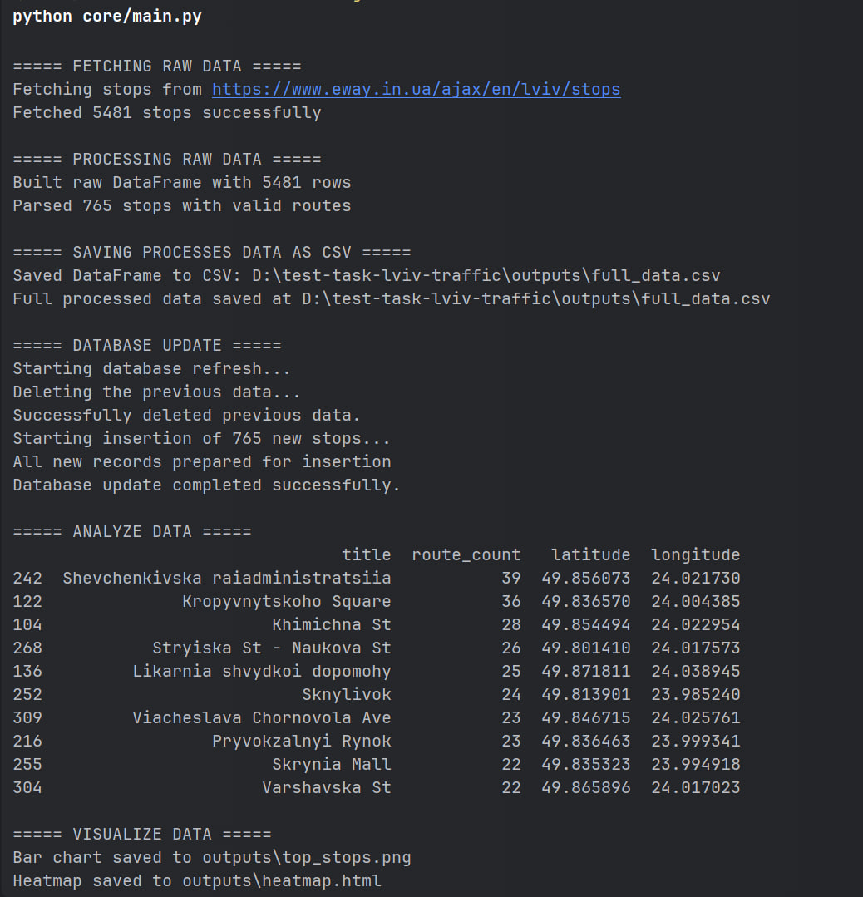
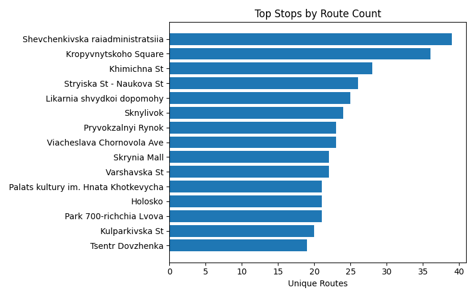
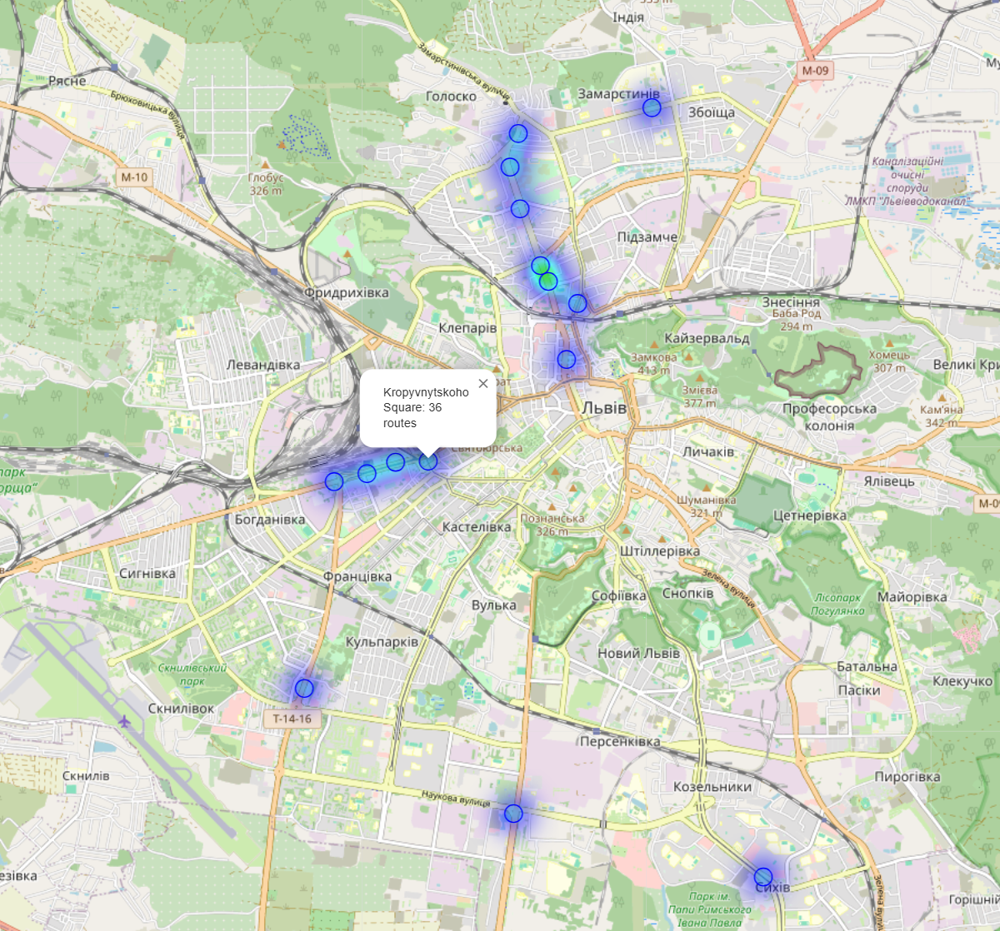

Technical Task Solution Overview
--- 
## Table of Contents:

- [Objective](#overview)
- [Analysis Strategy](#analysis-strategy)
- [Technologies](#technologies)
- [Getting Started](#getting-started)
- [Usage](#usage)
- [Output](#output)

---

### Objective
The goal of this project is to analyze Lviv public transport routes by tracking the most high-traffic stops and deliver a list of the highest-traffic locations in Lviv that present the greatest commercial opportunity.

---

### Analysis Strategy

To identify the locations with the highest traffic, the next steps were taken:
1. [**eway.in.ua**](https://www.eway.in.ua/ua/cities/lviv/routes) was scraped for all public transport stops in Lviv. The retrieved stops were filtered by the modes of transport they serve (trams, trolleybuses, minibuses).
2. For each stop, the total number of routes that the transport passes through was counted. Stops located on the same street were grouped and their routes summed to get street-level traffic.
3. Both individual stops and aggregated streets were ranked by their total route counts and top locations/streets with the highest traffic were selected for commercial suitability analysis.
4. Processed data was exported as a dataset into a CSV file and loaded into a MySQL database for any future queries or extensions.
5. To visualize the results, two charts were created: a horizontal bar chart to display the highest-traffic stops and a geospatial heatmap to overlay a map of Lviv to visually highlight traffic hotspots.


---

### Technologies

- **Python 3.11**: core language for scripting and analysis  
- **CloudScraper**: bypasses anti-bot measures to scrape stops and route data  
- **Pydantic**: validates and parses scraped data into typed models  
- **pandas**: cleans, transforms, and aggregates route/stop data  
- **Matplotlib** & **Folium**: visualize the results of the analysis
- **SQLAlchemy**: ORM for persisting processed data into MySQL  
- **CSV** & **MySQL**: storage of results for possible future queries

---

### Configuration

1. Project requires to have a .env file for some variables. Create one using the following example (defaults are also specified in core/config.py):
    ```dotenv
    BASE_URL=https://www.eway.in.ua # base URL for the API
    AJAX_PATH=/ajax # path to the endpoint
    CITY=lviv # city name
    LANGUAGE=en # data language
    USER_AGENT='Your User-Agent Here' # user agent for the request (look in core/config.py for default)
    DB_URL=mysql+mysqlconnector://<username>:<password>@localhost:3306/<database_name> # database URL
    TOP_N=10 # number of top stops to display
    OUTPUT_DIR=outputs # directory for saving outputs
    ```
---

### Getting Started

1. **Clone the repository**
   ```bash
   git clone https://github.com/NikitaPash/test-task-lviv-traffic.git
   cd repo
   ```
2. **Create a virtual environment** (recommended)
3. **Install dependencies**
   ```bash
   pip install -r requirements.txt
   ```

---

## Usage

1. **Launch** the app:
   ```bash
   python core/main.py
   ```
Result will be saved in the `outputs` directory. The script will create a CSV file with the processed data and generate visualizations.
Also, console output will be printed highlighting all steps of the process.
---

## Output

The analysis produces the following outputs:

1. **Data Processing Output**: The script processes raw data through several stages:
   - Fetches 5481 stops from [**eway.in.ua**](https://www.eway.in.ua/ua/cities/lviv/) and parses 765 stops with valid routes
   - Saves data to CSV format
   - Updates the MySQL database
   - Analyzes and ranks stops by route count
   - Generates visualizations

  

2. **Horizontal Bar Chart**: Displays the top public transport stops in Lviv ranked by the number of unique routes passing through them. Shevchenkivska raiadministratsiia appears to have the highest traffic with nearly 40 unique routes, followed by Kropyvnytskoho Square with 36 routes.

   

3. **Geospatial Heatmap**: Visualizes the distribution of high-traffic stops across Lviv on an interactive map. The blue circles and heat intensity represent concentration of public transport routes, with darker blue areas indicating higher traffic density. Major hotspots can be seen in the city center and along main transport corridors.

   

